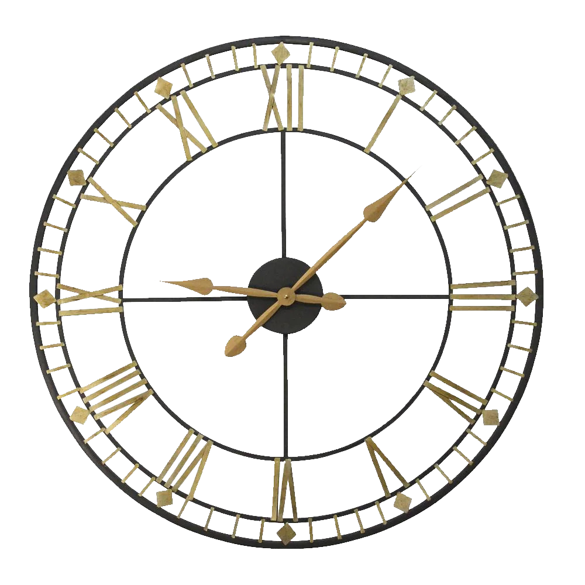

<!-- PROJECT LOGO -->
 

  

  <h3 align="center">Countdown Timer</h3>

  

    A simple and clean Countdown app for Android and iOS 
  

<!-- ABOUT THE PROJECT -->
## About The Project

Countdown Timer is a simple and clean Countdown app for Android and iOS. 
Create unlimited countdowns for your important events!

### Usage

  
  
  
  
  

 

### Built With

Countdown Timer is a React Native Application

* [JavaScript](https://developer.mozilla.org/en-US/docs/Web/JavaScript)
* [React.js](https://reactjs.org/)
* [React Native](https://reactnative.dev/)
* [Node.js](https://nodejs.org/)
* [Expo](https://expo.dev/)
* [NativeBase](https://nativebase.io/)
* [Babel](https://babeljs.io/)

<!-- GETTING STARTED -->
## Getting Started.

### User Installation

#### Prerequisites
    The minimum supported OS versions
    - Android: 5+
    - iOS: 10+

#### Steps

1. Download last installation file at: <a target="_blank" href="https://github.com/DanielAlarconCuesta/CountdownTimer/tree/master/buildings"/>Buildings</a>

2. Allow third-party installations in your device

3. Install app 

4. Open Countdown Timer and that's it. Ready to use!

### Developer Installation

#### Prerequisites
    Node.js 15+
    Npm 7+
    Expo 42+

#### Steps

1. In root path, run: npm install

2. Run: npm run start:dev (start app in develop mode)
    
   or
    
   Run: npm run start:prod (start app in prod mode)

3. Run: npm run buildAndroid (build App Bundle)
    
   or
    
   Run: npm run buildAndroidApk (build Apk)

<!-- ROADMAP -->
## Roadmap

- [-] Add Image feature to countdowns
- [-] Develop Widget of individual countdowns
- [-] Multi-language Support
    - [-] Spanish

<!-- CONTACT -->
## Contact

Daniel Alarcón  
<a href="https://www.linkedin.com/in daniel-alarc%C3%B3n-b85344169/">LinkedIn
</a> | 
danielalarconcuesta@gmail.com